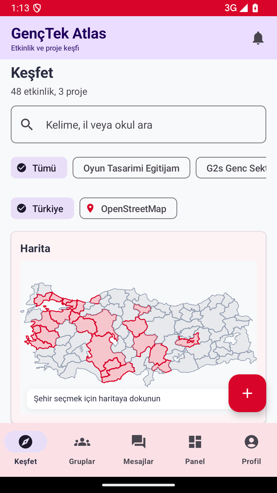
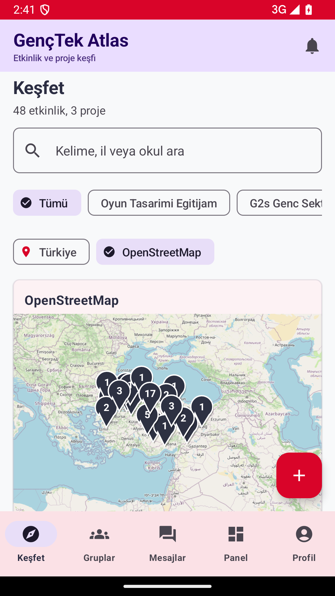
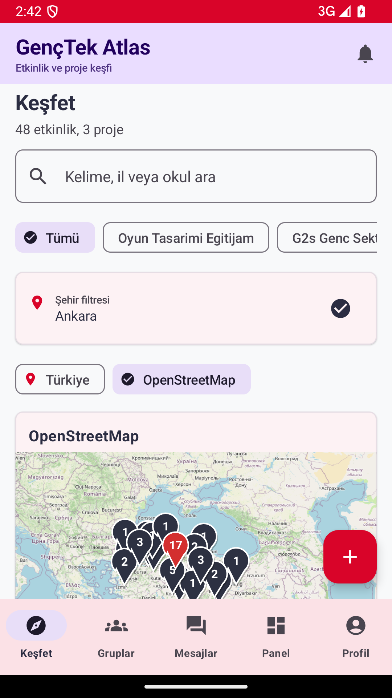
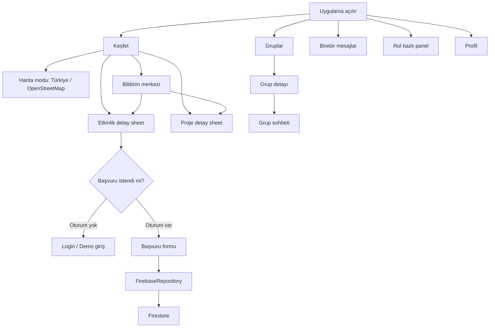
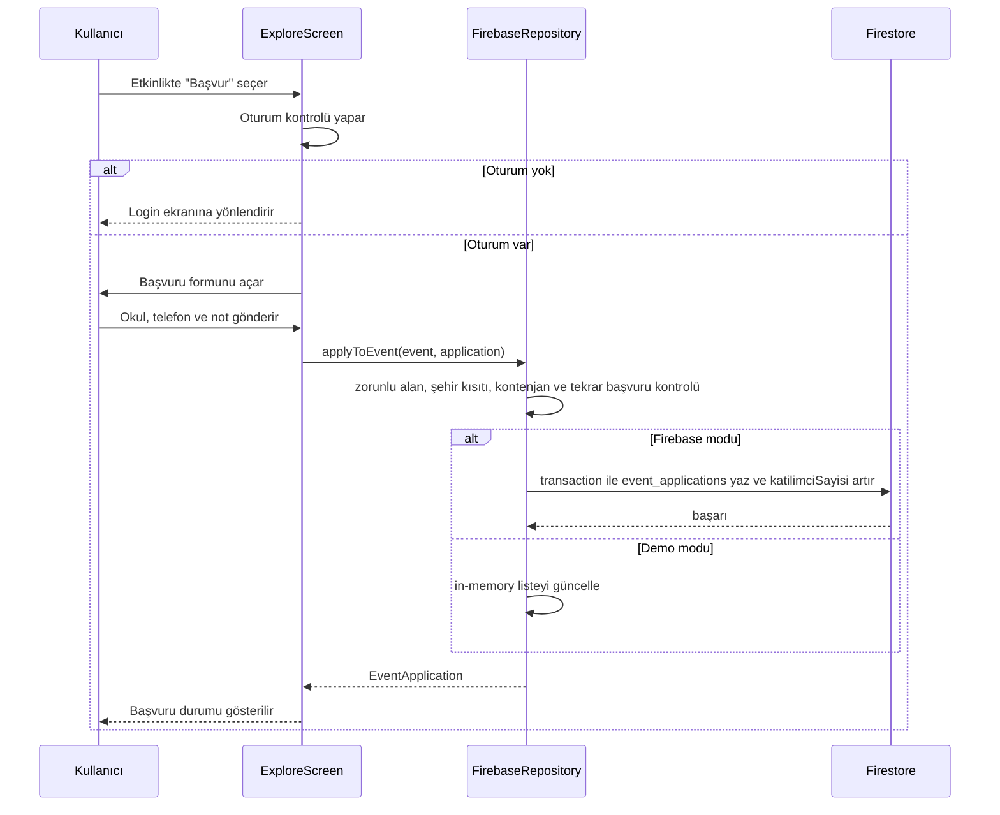
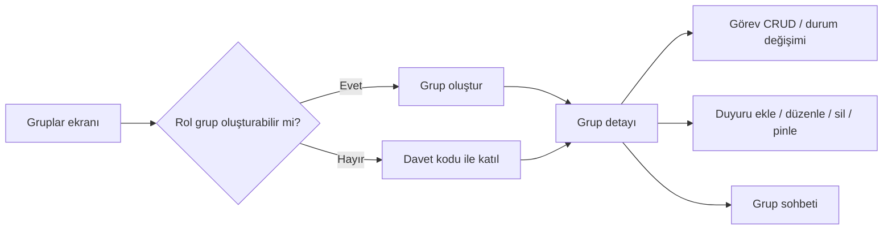
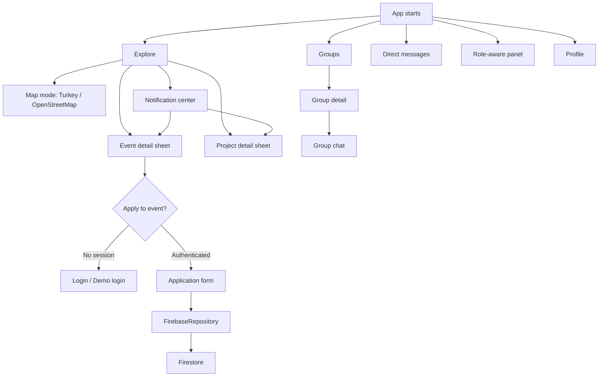
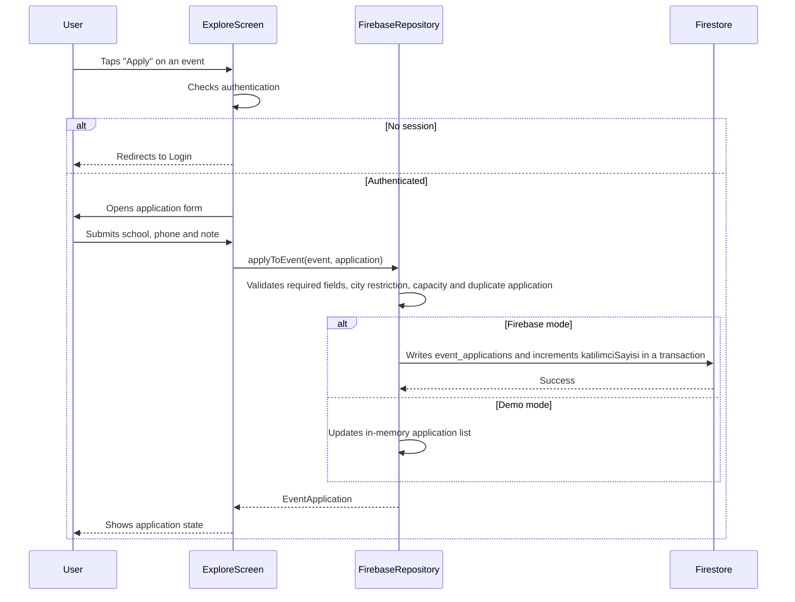
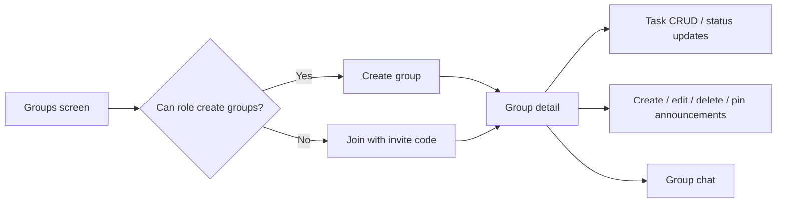

# GençTek Atlas Mobile

GençTek Atlas Mobile, web uygulamasındaki etkinlik, proje, başvuru, bildirim, çalışma grubu, sohbet, analiz ve yönetim paneli akışlarını Android için Jetpack Compose ile yeniden tasarlar. Uygulama Firebase ile çalışır; Firebase yapılandırması yoksa aynı ekranlar demo veriyle kırılmadan açılır.

## Ekran Görüntüleri

<p>
  
  
  
</p>

## Ana Özellikler

- Keşfet: etkinlik ve proje listesi, tema/şehir filtreleri, etkinlik fotoğraf galerisi, etkinlik bağlantısı, proje bağlantıları ve başvuru akışı.
- Harita: yerel SVG Türkiye haritası ve native OpenStreetMap görünümü. OSM tarafında kırmızı sayılı pinler, şehir bazlı küme çözülmesi, pin bilgi kartı ve detay ekranına geçiş vardır.
- Bildirim merkezi: bildirim/duyuru sekmeleri, okunma durumu, tümünü okundu yapma, silme ve ilgili detay ekranına yönlendirme.
- Gruplar: rol bazlı grup oluşturma, davet kodu ile katılım, grup detayı, görevler, duyurular ve grup sohbeti.
- Mesajlar: kişi keşfi, birebir sohbet, okunma durumu ve demo/Firebase veri desteği.
- Panel: rol bazlı analiz, başvuru yönetimi, admin moderasyonu, okul profili ve okul özetleri.
- Profil: kullanıcı düzenleme, demo giriş, Firebase Auth giriş/kayıt ve çıkış.

## Teknoloji

- Kotlin, Jetpack Compose, Material 3
- Navigation Compose
- Firebase Auth, Firestore, Storage, Messaging
- Hilt dependency injection
- Coil image loading
- osmdroid OpenStreetMap renderer
- Yerel WebView/SVG harita assetleri

## Proje Yapısı

```text
app/src/main/java/tr/ademyuce/genctekatlas/
  AtlasApplication.kt              Firebase bootstrap ve demo moda düşme
  MainActivity.kt                  Alt navigasyon ve route ağacı
  data/model/Models.kt             Firestore ve UI model sınıfları
  data/repository/FirebaseRepository.kt
                                   Firebase + demo veri katmanı
  ui/screen/ExploreScreen.kt       Keşfet, bildirim, başvuru, detay sheetleri
  ui/screen/AtlasMapCard.kt        Yerel SVG Türkiye haritası
  ui/screen/OsmMapCard.kt          Native OSM pin/küme haritası
  ui/screen/GroupsScreen.kt        Gruplar, görevler, duyurular, grup sohbeti
  ui/screen/MessagesScreen.kt      Birebir sohbet
  ui/screen/DashboardScreen.kt     Analiz, başvuru ve admin/okul panelleri
  ui/screen/EventFormScreen.kt     Etkinlik oluşturma
  ui/screen/ProjectFormScreen.kt   Proje oluşturma
  ui/screen/MobileUi.kt            Ortak mobil UI bileşenleri

app/src/main/assets/
  map.html                         Yerel harita WebView kabuğu
  map/turkey.svg                   Yerel Türkiye SVG haritası
  data/turkey-provinces.*          Harita veri assetleri
```

## Uygulama Akışı

Alt navigasyon 5 ana alandan oluşur: Keşfet, Gruplar, Mesajlar, Panel ve Profil. Giriş gerektiren bir işlemde kullanıcı oturumu yoksa Login ekranına yönlendirilir; Firebase yoksa demo kullanıcı ve mock veriyle aynı akış korunur.



## Harita Algoritması

Uygulamada iki harita modu vardır. Yerel Türkiye haritası offline güvenli fallback olarak çalışır; OpenStreetMap modu ise native osmdroid ile tile, zoom ve pin etkileşimi sağlar.

### Yerel Türkiye Haritası

1. `map.html` ve `map/turkey.svg` APK assetleri içine paketlenir.
2. `AtlasMapCard`, etkinlik/proje listesinden şehir istatistiklerini üretir.
3. Kotlin tarafı şehir, etkinlik sayısı, proje sayısı ve seçili şehir bilgisini JSON olarak WebView haritasına aktarır.
4. WebView bridge `onMapReady`, `onCitySelected` ve `onMapError` callbackleriyle Compose tarafına durum döndürür.
5. WebView hata verirse şehir filtresi işlevini koruyan native fallback liste gösterilir.
6. İstanbul Asya/Avrupa gibi SVG varyantları filtrede tek `İstanbul` şehrine normalize edilir.

### Native OpenStreetMap

1. `OsmMapCard`, etkinlikleri ve projeleri `OsmPoint` listesine dönüştürür.
2. Her kayıt için öncelik sırası koordinat alanlarıdır: etkinlikte `enlem/boylam`, yoksa şehir merkez koordinatı.
3. Kayıtlar normalize şehir adına göre gruplanır.
4. Şehirde tek kayıt varsa doğrudan tekil kırmızı pin çizilir.
5. Şehirde birden fazla kayıt varsa uzak zoom seviyesinde kırmızı sayılı küme pini gösterilir.
6. Küme pinine tıklanınca harita ilgili şehre zoom yapar, şehir filtresi güncellenir ve grup çözülerek tekil pinler halka düzeninde dağıtılır.
7. Tekil pine tıklanınca harita daha yakın zoom yapar ve etkinlik/proje bilgi kartı açılır.
8. Bilgi kartına tıklanınca mevcut etkinlik veya proje detay sheet'i açılır.

Isı haritası tek başına ana etkileşim olarak kullanılmıyor; çünkü etkinlik detayına giden pin kartı akışı için tıklanabilir hedef ve sayı bilgisi gerekir. İleride yoğunluk katmanı olarak hibrit şekilde eklenebilir.

## Başvuru Algoritması

Etkinlik başvuruları hem demo modda hem Firestore üzerinde aynı kurallarla çalışır.



Kurallar:

- Kullanıcı giriş yapmadan başvuru yapamaz.
- Aynı kullanıcı aynı etkinliğe ikinci kez başvuramaz.
- Kontenjan doluysa başvuru engellenir.
- İl kısıtı olan etkinlikte kullanıcının başvuru ili etkinlik iliyle eşleşmelidir.
- Firestore modunda tekrar başvuru ve kontenjan kontrolü transaction içinde yapılır.

## Grup ve Sohbet Akışı

Gruplar rol bazlı yönetilir. `admin`, `coordinator` ve `principal` rolleri grup oluşturabilir; diğer kullanıcılar davet koduyla gruba katılır. Grup detayında üyeler, görevler, duyurular ve grup sohbeti aynı ekranda yönetilir.



Birebir mesajlaşmada `MessagesScreen`, kişi listesini `users` koleksiyonundan veya demo veriden alır. Seçilen kişi için iki yönlü `direct_messages` kayıtları birleştirilir, zamana göre sıralanır ve konuşma açıldığında okunma durumu güncellenir.

## Panel Akışı

Panel role-aware çalışır:

| Rol | Görünen akışlar |
| --- | --- |
| student | Analiz özetleri ve kendi profil verisi |
| teacher | Analiz, başvuru yönetimi, okul profili |
| principal | Analiz, başvuru yönetimi, okul profili, grup görünümü |
| coordinator | Analiz, başvuru yönetimi, moderasyon, duyuru/bildirim |
| admin | Tüm analiz, moderasyon, başvuru, duyuru, bildirim ve özet sayaçları |

Admin/moderasyon panelinde bekleyen etkinlik ve projeler onaylanabilir veya reddedilebilir. Başvuru panelinde `beklemede`, `onaylandı` ve `reddedildi` durumları yönetilir.

## Firebase Veri Modeli

Uygulama aşağıdaki Firestore koleksiyonlarıyla uyumludur:

| Koleksiyon | Kullanım |
| --- | --- |
| `users` | Auth profili, rol, şehir, okul, XP |
| `students` | Öğrenci profil kayıtları ve okul paneli |
| `teachers` | Web paritesi için öğretmen kayıtları |
| `events` | Etkinlikler, koordinat, kontenjan, fotoğraf galerisi, onay durumu |
| `projects` | Projeler, bağlantılar, tema, görsel ve onay durumu |
| `event_applications` | Etkinlik başvuruları ve yönetim durumları |
| `groups` | Çalışma grupları ve davet kodları |
| `group_tasks` | Grup görevleri |
| `group_announcements` | Grup duyuruları |
| `group_messages` | Grup sohbet mesajları |
| `direct_messages` | Birebir sohbet mesajları |
| `notifications` | Kullanıcı/global bildirimler |
| `announcements` | Genel duyurular |
| `custom_schools` | Okul listesi |
| `themes` | Tema listesi |

## Demo Mod

`AtlasApplication`, Firebase yapılandırması bulunamazsa Firebase'i başlatmaz. `FirebaseRepository` bu durumda `isDemoMode = true` ile mock ve in-memory veriye geçer. Bu sayede harita, keşfet, başvuru, grup, sohbet, panel ve profil ekranları Firebase olmadan da kullanılabilir.

Demo modun amacı geliştirme ve UI doğrulamasıdır; gerçek kalıcılık için `.env` içindeki Firebase alanları doldurulmalıdır.

## Kurulum

1. Android Studio ile projeyi açın.
2. JDK 17 kullandığınızdan emin olun.
3. `.env.example` dosyasını `.env` olarak kopyalayın.
4. Firebase proje bilgilerini `.env` içine girin.
5. Firestore koleksiyonlarını yukarıdaki veri modeliyle oluşturun veya uygulamanın demo moduyla başlayın.

Örnek `.env`:

```properties
MAPS_API_KEY=
FIREBASE_API_KEY=...
FIREBASE_PROJECT_ID=...
FIREBASE_APPLICATION_ID=...
FIREBASE_MESSAGING_SENDER_ID=...
FIREBASE_STORAGE_BUCKET=...
FIREBASE_DATABASE_URL=
GEMINI_API_KEY=
CUSTOM_BACKEND_URL=
```

Bu proje Firebase'i `BuildConfig` üzerinden programatik başlatır. `google-services.json` zorunlu değildir.

## Derleme ve Test

```bash
./gradlew :app:compileDebugKotlin
./gradlew :app:assembleDebug
```

Harita doğrulama kontrol listesi:

- `app/src/main/assets/map.html` APK içine giriyor.
- `app/src/main/assets/map/turkey.svg` APK içine giriyor.
- Keşfet ekranında yerel Türkiye haritası nonblank görünüyor.
- OpenStreetMap modunda kırmızı sayılı pinler görünüyor.
- Küme pinine tıklayınca harita ilgili şehre zoom yapıyor ve tekil pinlere ayrılıyor.
- Tekil etkinlik/proje pinine tıklayınca bilgi kartı açılıyor.
- Bilgi kartına tıklayınca ilgili detay sheet'i açılıyor.

Akış doğrulama kontrol listesi:

- Girişsiz kullanıcı etkinliğe başvurmak isterse Login ekranına yönlenir.
- Girişli kullanıcı başvuru yapabilir, ikinci başvuru engellenir.
- Bildirimden ilgili etkinlik/proje detayına gidilir.
- Grup oluşturma yalnızca yetkili rollerde görünür/çalışır.
- Davet koduyla gruba katılım, görev durumu değiştirme ve grup duyurusu çalışır.
- Birebir sohbet ve grup sohbeti mesaj gönderir.
- Admin panelinde etkinlik/proje ve başvuru onay/red akışları çalışır.
- Analiz ve okul profili demo veri, boş veri ve Firebase veri durumlarında kırılmaz.

## Yayın / Repo

Hedef GitHub deposu:

```text
https://github.com/adeministratorr/genctek_atlas_mobile_android_studio_firebase.git
```

Build çıktıları commit'e alınmaz. `app/build/` `.gitignore` kapsamındadır.

---

# GencTek Atlas Mobile (English)

GencTek Atlas Mobile is an Android implementation of the GencTek Atlas web application flows. It brings event discovery, project discovery, event applications, notifications, working groups, chat, analytics, school panels and admin moderation into a mobile-first Jetpack Compose app. The app is designed to run with Firebase, but it also falls back to demo data when Firebase configuration is missing.

## Screenshots

<p>
  
  
  
</p>

## Features

- Explore: event and project lists, theme/city filters, event photo gallery, event link button, project links and event application flow.
- Maps: local SVG Turkey map and native OpenStreetMap mode. OSM uses red numbered pins, city-based cluster expansion, marker info cards and detail navigation.
- Notification center: notification/announcement tabs, read state, mark all as read, delete and open related event/project details.
- Groups: role-aware group creation, invite-code join flow, group detail, tasks, announcements and group chat.
- Messages: contact discovery, direct chat, read state and Firebase/demo data support.
- Panel: role-aware analytics, application management, admin moderation, school profile and school summaries.
- Profile: user profile editing, demo login, Firebase Auth login/register and logout.

## Tech Stack

- Kotlin, Jetpack Compose, Material 3
- Navigation Compose
- Firebase Auth, Firestore, Storage and Messaging
- Hilt dependency injection
- Coil image loading
- osmdroid OpenStreetMap renderer
- Local WebView/SVG map assets

## Project Structure

```text
app/src/main/java/tr/ademyuce/genctekatlas/
  AtlasApplication.kt              Firebase bootstrap and demo fallback
  MainActivity.kt                  Bottom navigation and route graph
  data/model/Models.kt             Firestore and UI data models
  data/repository/FirebaseRepository.kt
                                   Firebase + demo data layer
  ui/screen/ExploreScreen.kt       Explore, notifications, applications and detail sheets
  ui/screen/AtlasMapCard.kt        Local SVG Turkey map
  ui/screen/OsmMapCard.kt          Native OSM pin/cluster map
  ui/screen/GroupsScreen.kt        Groups, tasks, announcements and group chat
  ui/screen/MessagesScreen.kt      Direct messaging
  ui/screen/DashboardScreen.kt     Analytics, applications and admin/school panels
  ui/screen/EventFormScreen.kt     Event creation
  ui/screen/ProjectFormScreen.kt   Project creation
  ui/screen/MobileUi.kt            Shared mobile UI components

app/src/main/assets/
  map.html                         Local map WebView shell
  map/turkey.svg                   Local Turkey SVG map
  data/turkey-provinces.*          Map data assets
```

## App Flow

The app has five main bottom navigation areas: Explore, Groups, Messages, Panel and Profile. If a user starts an action that requires authentication, the app redirects to Login. If Firebase is not configured, the same screens stay functional with demo users and mock data.



## Map Algorithm

The app supports two map modes. The local Turkey map is an offline-safe fallback. OpenStreetMap mode uses native osmdroid rendering for tiles, zooming and pin interaction.

### Local Turkey Map

1. `map.html` and `map/turkey.svg` are packaged as APK assets.
2. `AtlasMapCard` computes city statistics from the current event/project lists.
3. Kotlin sends city, event count, project count and selected city state to the WebView as JSON.
4. The WebView bridge reports state through `onMapReady`, `onCitySelected` and `onMapError`.
5. If WebView rendering fails, the UI shows a native city selector fallback with the same filtering behavior.
6. SVG variants such as Istanbul Asia/Europe are normalized into a single `Istanbul` filter value.

### Native OpenStreetMap

1. `OsmMapCard` maps events and projects into an `OsmPoint` list.
2. Coordinate priority is event `enlem/boylam`; if missing, the app uses known city-center coordinates.
3. Points are grouped by normalized city name.
4. A city with a single point is rendered as one red item pin.
5. A city with multiple points is rendered as a red numbered cluster pin at low zoom.
6. Tapping a cluster zooms into the city, updates the city filter and expands the group into individual item pins arranged around the city center.
7. Tapping an item pin zooms closer and opens an event/project info card.
8. Tapping the info card opens the existing event or project detail sheet.

The current UX intentionally keeps clustering as the primary interaction. A heatmap alone is weaker for this app because users need precise clickable targets, counts and a direct path to event details. A future version can add heatmap as an optional density overlay.

## Event Application Algorithm

Event applications use the same rules in Firebase and demo mode.



Rules:

- A user must be logged in to apply.
- The same user cannot apply to the same event twice.
- The app blocks applications when capacity is full.
- If a city restriction is enabled, the applicant city must match the event city.
- In Firebase mode, duplicate and capacity checks run inside a Firestore transaction.

## Groups and Chat Flow

Groups are role-aware. `admin`, `coordinator` and `principal` can create groups; other users can join by invite code. Group detail includes members, tasks, announcements and group chat.



For direct messages, `MessagesScreen` loads contacts from the `users` collection or demo data. It merges sent and received `direct_messages`, sorts them by timestamp and marks the conversation as read when opened.

## Panel Flow

The panel is role-aware:

| Role | Visible flows |
| --- | --- |
| student | Analytics summaries and own profile data |
| teacher | Analytics, application management, school profile |
| principal | Analytics, application management, school profile, group visibility |
| coordinator | Analytics, application management, moderation, announcements/notifications |
| admin | Full analytics, moderation, applications, announcements, notifications and summary counters |

The admin/moderation panel can approve or reject pending events and projects. The applications panel manages `beklemede`, `onaylandı` and `reddedildi` states.

## Firebase Data Model

The app is compatible with these Firestore collections:

| Collection | Purpose |
| --- | --- |
| `users` | Auth profile, role, city, school and XP |
| `students` | Student profile records and school panel data |
| `teachers` | Teacher records for web parity |
| `events` | Events, coordinates, capacity, photo gallery and approval state |
| `projects` | Projects, links, theme, visual and approval state |
| `event_applications` | Event applications and management status |
| `groups` | Working groups and invite codes |
| `group_tasks` | Group tasks |
| `group_announcements` | Group announcements |
| `group_messages` | Group chat messages |
| `direct_messages` | Direct chat messages |
| `notifications` | User/global notifications |
| `announcements` | Global announcements |
| `custom_schools` | School list |
| `themes` | Theme list |

## Demo Mode

`AtlasApplication` does not initialize Firebase when configuration is missing. In that case, `FirebaseRepository` switches to `isDemoMode = true` and serves mock/in-memory data. Explore, maps, applications, groups, chat, panel and profile remain usable without Firebase.

Demo mode is intended for development and UI validation. Fill `.env` with Firebase credentials for real persistence.

## Setup

1. Open the project in Android Studio.
2. Use JDK 17.
3. Copy `.env.example` to `.env`.
4. Fill Firebase project values in `.env`.
5. Create the Firestore collections listed above or start with demo mode.

Example `.env`:

```properties
MAPS_API_KEY=
FIREBASE_API_KEY=...
FIREBASE_PROJECT_ID=...
FIREBASE_APPLICATION_ID=...
FIREBASE_MESSAGING_SENDER_ID=...
FIREBASE_STORAGE_BUCKET=...
FIREBASE_DATABASE_URL=
GEMINI_API_KEY=
CUSTOM_BACKEND_URL=
```

This project initializes Firebase programmatically through `BuildConfig`. `google-services.json` is not required.

## Build and Test

```bash
./gradlew :app:compileDebugKotlin
./gradlew :app:assembleDebug
```

Map verification checklist:

- `app/src/main/assets/map.html` is packaged into the APK.
- `app/src/main/assets/map/turkey.svg` is packaged into the APK.
- The local Turkey map is nonblank in Explore.
- OpenStreetMap mode shows red numbered pins.
- Tapping a cluster zooms into the related city and expands into item pins.
- Tapping an event/project item pin opens an info card.
- Tapping the info card opens the related detail sheet.

Flow verification checklist:

- Unauthenticated application attempts redirect to Login.
- Authenticated users can apply to events, and duplicate applications are blocked.
- Notifications can open related event/project details.
- Group creation is available only to authorized roles.
- Invite-code join, task status updates and group announcements work.
- Direct chat and group chat can send messages.
- Admin panel approval/rejection flows work for events, projects and applications.
- Analytics and school profile screens do not break with empty, demo or Firebase data.

## Repository

Target GitHub repository:

```text
https://github.com/adeministratorr/genctek_atlas_mobile_android_studio_firebase.git
```

Build outputs are not committed. `app/build/` is covered by `.gitignore`.
